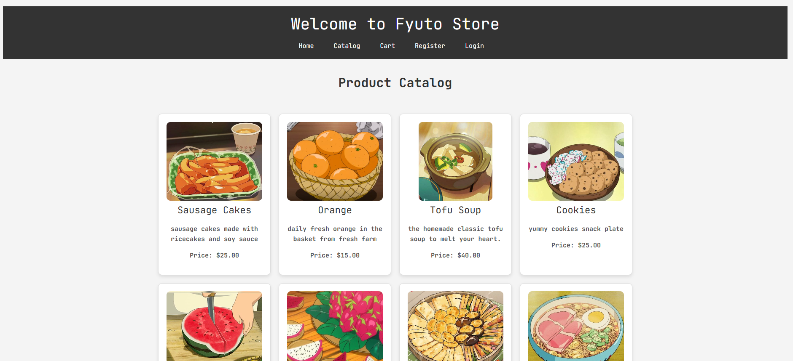
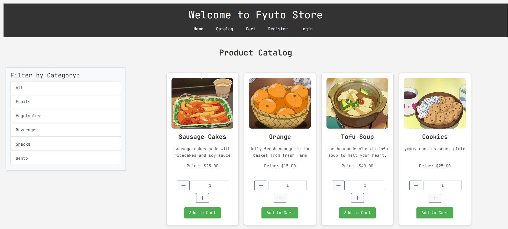
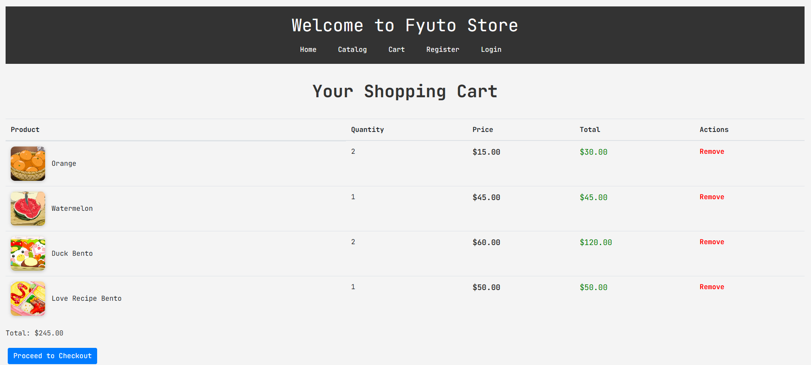
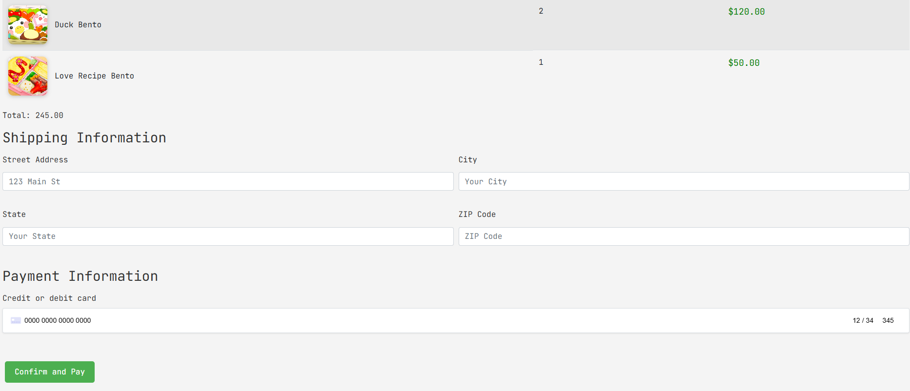
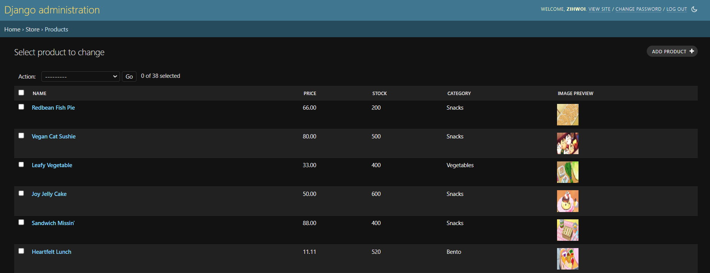
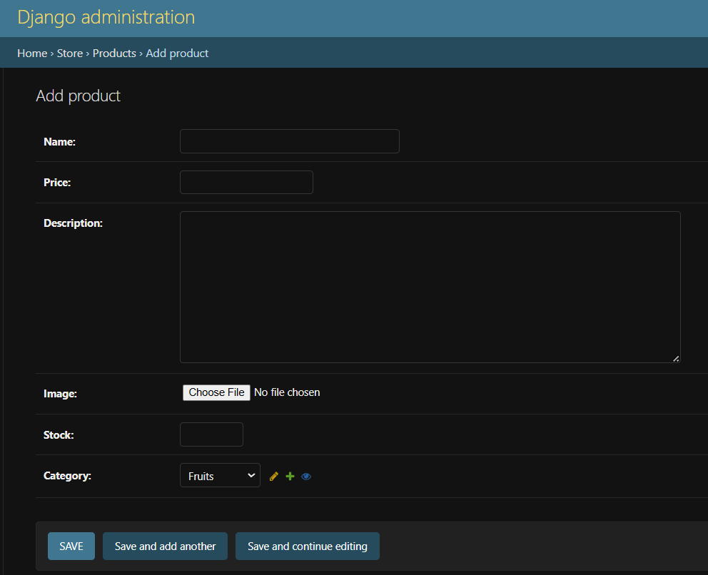
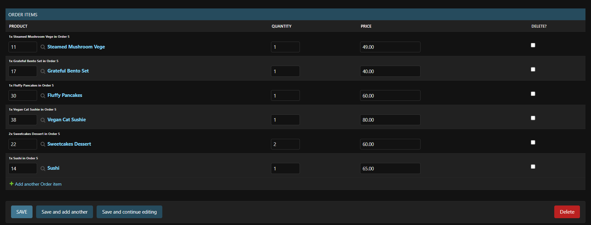

# Fyuto - E-Commerce Store with Django and Stripe Payment Integration

## Project Overview

**Fyuto** is an e-commerce web application built with Django, designed to provide a seamless shopping experience for users. The store offers a product catalog, shopping cart, checkout system, and secure payment integration using Stripe. The admin panel allows store owners to easily manage products and orders.

### Purpose

The purpose of **Fyuto** is to create a functional e-commerce platform while demonstrating the integration of essential features like user authentication, product management, and secure payment processing. 

**Goals:**
1. **Learning Goal:** Gain experience in Django web development, PostgreSQL database management, and Stripe payment integration.
2. **Business Goal:** Build a platform to sell physical goods, digital products, or services.
3. **Portfolio Goal:** Showcase backend and frontend skills, including payment gateway integration and UI/UX design.

## Features

   
   
1. **User Authentication:**
   - User registration, login, and logout functionality.
   - Users can track their orders and manage their accounts.

   
2. **Product Catalog:**
   - Display a catalog of products with categories and filtering options.
   - Product details page with images, descriptions, and prices.
   

   
3. **Shopping Cart & Checkout:**
   - Add products to the shopping cart.
   - Secure checkout process with Stripe payment gateway integration.
   - Review orders before completing the purchase.
   



4. **Admin Panel:**
   - Easy-to-use interface for store owners to add, edit, or remove products.
   - Manage customer orders and track order status.
   

   

## Tech Stack

- **Backend:** Django (Python), PostgreSQL (Database)
- **Frontend:** HTML, CSS, JavaScript
- **Payment Integration:** Stripe
- **Deployment:** (e.g., Heroku/AWS)

## Installation and Setup

Follow the steps below to set up and run the project locally.

### 1. Clone the repository

```bash
git clone https://github.com/yourusername/fyuto.git
cd fyuto
```

```bash
python -m venv venv
venv\Scripts\activate  # On Mac use `source venv\bin\activate`
```

```bash
pip install -r requirements.txt
```


